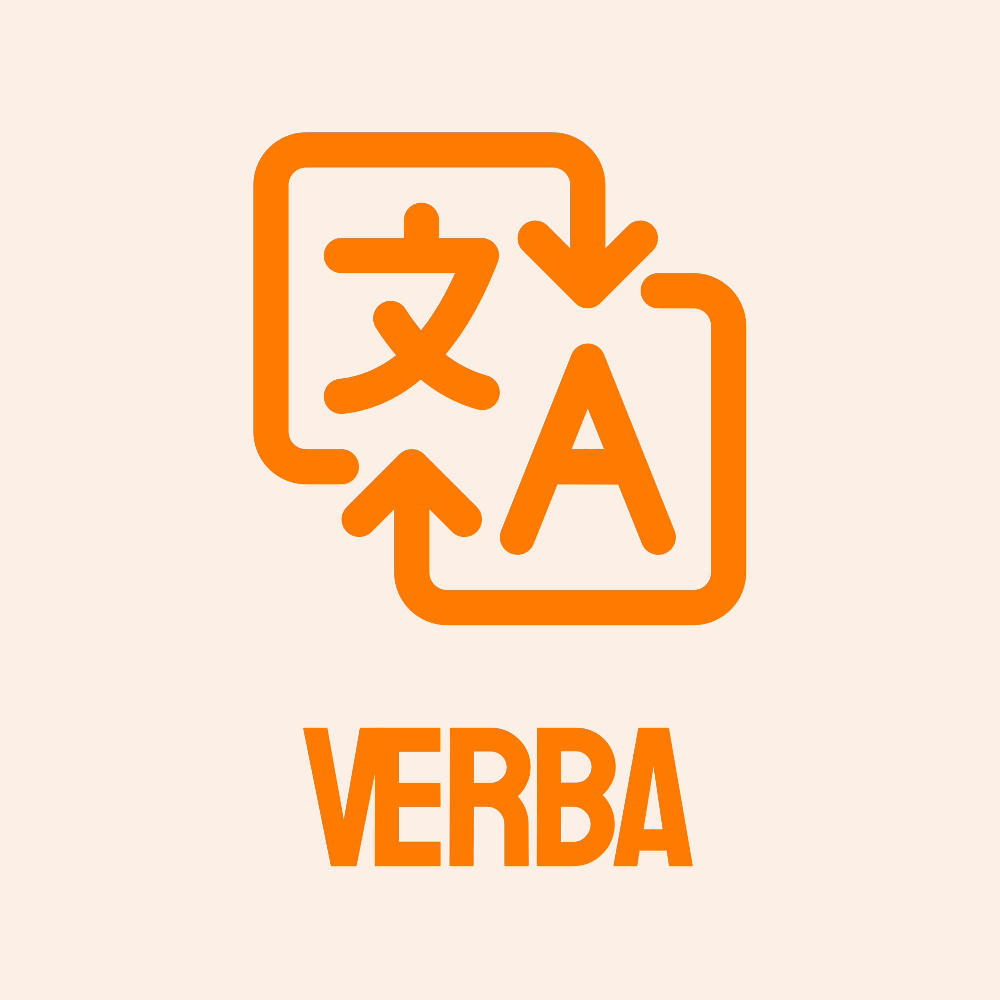

# Verba

Verba is a community-driven, open-source language learning application designed to make language education accessible to everyone. The app is completely free, with no advertisements, subscriptions, or paywalls.

Developed with Flutter, Verba uses transparent, easy-to-edit lesson formats that allow developers, educators, and language learners to contribute new languages and improve existing content. The project focuses on practical vocabulary, real-world usage, and clarity over aggressive gamification or artificial limitations.
